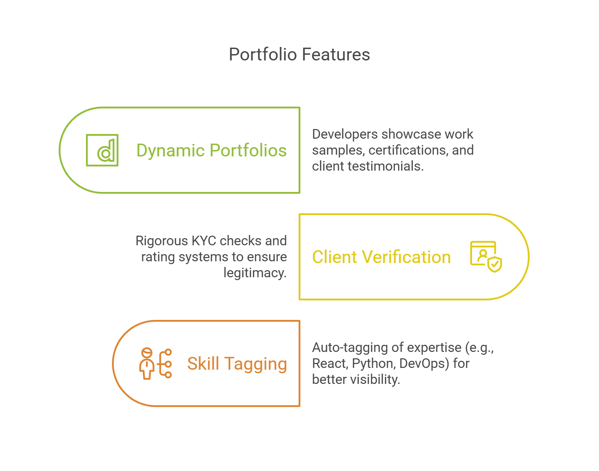

# Project Report: DevHive – Global Freelancing Marketplace for Local Developers

**Repository Link:** [https://github.com/hasanshahriar32/devhiveclient](https://github.com/hasanshahriar32/devhiveclient)

**Project Proposal:** [https://github.com/hasanshahriar32/devhive](https://github.com/hasanshahriar32/devhive)

---

### **1. Executive Summary**

**DevHive** is a groundbreaking platform designed to bridge the gap between local developers and global freelancing opportunities. By combining a secure, scalable marketplace with developer-centric tools, the platform empowers freelancers to showcase their skills, collaborate on international projects, and manage transactions transparently. The client-side application, built with **React.js** and **Tailwind CSS**, serves as the frontend interface for this ecosystem, enabling seamless interactions between developers, clients, and project workflows. This report outlines the platform’s architecture, features, and strategic alignment with its mission to democratize access to global opportunities for local talent.

---

### **2. Introduction**

The global freelancing market is rapidly expanding, yet many skilled developers in underserved regions struggle to access opportunities due to geographic, linguistic, or infrastructural barriers. DevHive addresses these challenges by creating a unified hub where developers can:

- Showcase their expertise through dynamic portfolios.
- Bid on or instantly accept global projects.
- Manage deliverables, payments, and client relationships efficiently.
- Access localized resources and continuous learning tools.

The platform prioritizes **security**, **transparency**, and **user empowerment**, fostering a competitive yet collaborative environment for freelancers and clients.

---

### **3. Objectives**

1. **Global Opportunity Access**: Connect local developers with international clients through a streamlined job-matching system.
2. **Secure Collaboration**: Implement robust authentication, encrypted communication, and milestone-based payments to minimize disputes.
3. **Skill Development**: Integrate learning resources and project templates to help freelancers upskill.
4. **Community Growth**: Build a vibrant ecosystem through forums, reviews, and networking tools.
5. **Scalability**: Design modular architecture to support future expansions like AI-driven matching and mobile apps.

---

### **4. Key Features**

### **A. Freelancer & Client Profiles**

- **Dynamic Portfolios**: Developers showcase work samples, certifications, and client testimonials.

- **Client Verification**: Rigorous KYC checks and rating systems to ensure legitimacy.
- **Skill Tagging**: Auto-tagging of expertise (e.g., React, Python, DevOps) for better visibility

### **B. Job Marketplace**

- **Job Posting & Bidding**: Clients post projects with budgets and deadlines; developers submit bids.
- **Instant Hire**: Pre-vetted "Top Talent" developers can be hired directly based on client criteria.
- **AI-Powered Matching**: Future integration to recommend jobs based on skills and past projects.

### **C. Collaboration & Project Management**

- **Real-Time Messaging**: In-app chat with **integrated translation** to overcome language barriers.**Milestone Tracking**: Clients and developers define deliverables, timelines, and payment schedules.
- **Code Repository**: Built-in Git integration for collaborative coding (planned).

### **D. Financial Security**

- **Escrow Payments**: Funds held in escrow until milestones are approved.
- **Multi-Currency Support**: Automatic currency conversion for international transactions.
- **Dispute Resolution**: Mediation tools and transparent logs to resolve conflicts.

### E. Community & Engagement

- **Analytics Dashboard**: Developers track earnings, project success rates, and skill growth.
- **Developer Forums**: Topic-based discussions (e.g., "Web3 Development," "Career Advice").
- **Learning Hub**: Curated tutorials, coding challenges, and certification partnerships.

---

### **5. Technical Architecture**

### **Frontend**

- **Framework**: React.js with TypeScript (future migration).
- **Styling**: Tailwind CSS + DaisyUI for modular, responsive design.
- **State Management**: Redux Toolkit for complex workflows (e.g., bidding, payments).
- **Routing**: React Router v6 with role-based access control (RBAC).

### **Backend**

- **API Layer**: Node.js + Express.js for RESTful endpoints.
- **Database**: MongoDB with Atlas for scalability; Redis for caching.
- **Authentication**: JWT with HTTP-only cookies + OAuth 2.0 (future).
- **Real-Time Features**: [Socket.io](http://socket.io/) for chat and notifications.

### **DevOps & Security**

- **Hosting**: Vercel (frontend), AWS EC2 (backend).
- **CI/CD**: GitHub Actions for automated testing and deployment.
- **Security**: Rate limiting, SQL injection prevention, and SSL encryption.

### **Third-Party Integrations**

- **Payment Gateway**: SSLCommerz for local transactions; Stripe (planned for global).
- **Analytics**: Google Analytics for user behavior tracking.
- **Translation**: DeepL API for real-time chat translation.

---

### **6. System Workflow**

1. **User Onboarding**
    - Developers/clients register with multi-factor authentication (MFA).
    - Profile setup with skill tagging (developers) or project requirements (clients).
    

1. **Job Lifecycle**
    - Client posts job → Developers bid → Client selects freelancer → Milestones defined.
    - Escrow payment initiated → Deliverables submitted → Client approval → Payment released.
    
    
    
2. **Dispute Handling**
    - Raise dispute → Mediation chat → Admin review → Escrow refund/release.

---

### **7. Challenges & Solutions**

| **Challenge** | **Solution** |
| --- | --- |
| **Cross-Border Payments** | Partner with multi-currency payment gateways. |
| **Language Barriers** | Integrated translation API + community moderation. |
| **Fraud Prevention** | JWT + IP tracking + client verification checks. |
| **Scalability** | Microservices architecture + MongoDB sharding. |

---

### **8. Marketing & User Acquisition**

- **Phase 1**: Target local developer communities via LinkedIn, GitHub, and tech meetups.
- **Phase 2**: Collaborate with coding boot camps (e.g., free portfolio workshops).
- **Phase 3**: Launch referral programs with cashback incentives for top freelancers.
- **Phase 4**: Expand globally via Google Ads targeting SMEs seeking affordable tech talent.

---

### **9. Future Roadmap**

| **Phase** | **Timeline** | **Features** |
| --- | --- | --- |
| **Alpha** | Q3 2024 | Core job marketplace, escrow payments, basic chat. |
| **Beta** | Q4 2024 | Forums, learning hub, mobile-responsive UI. |
| **Launch** | Q1 2025 | AI job matching, OAuth, Stripe integration. |
| **Scale** | Q3 2025 | Mobile apps, contract templates, API marketplace. |

---

### **10. Team Members**

### **1. Shahriar Hasan**

- **Role**: Lead Frontend Developer
- **Expertise**: MERN Stack, Next.js, AWS
- **Portfolio**: [shahriarhasan.vercel.app](https://shahriarhasan.vercel.app/)

### **2. Md Taufiq Biswas**

- **Role**: Backend & DevOps Engineer
- **Expertise**: Node.js, MongoDB, Cloud Architecture

### **3. Sarah Masrura Mumu**

- **Role**: UI/UX Designer & Community Manager
- **Expertise**: User Research, Figma, Content Strategy

---

### **11. Conclusion**

DevHive reimagines freelancing as a collaborative, growth-oriented journey rather than a transactional exchange. By combining robust technology with community-driven features, the platform not only connects talent with opportunity but also fosters long-term career development for developers worldwide. With a clear roadmap and scalable architecture, DevHive is poised to become the go-to marketplace for local developers seeking global impact.

**Submitted By**: DevHive Team

**Date**: 3/9/25

---

**Appendices**

- **API Documentation**: https://devhiveserver.vercel.app
- **User Feedback Report**: https://github.com/hasanshahriar32/devhiveclient
- **Security Audit Summary**: https://github.com/hasanshahriar32/devhiveclient
